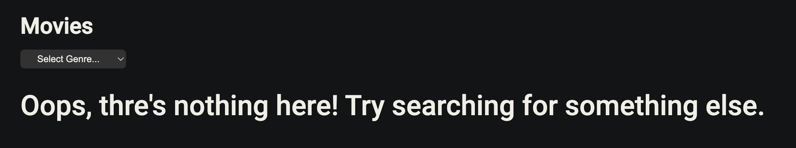

# BoolFlix

This project is a mockup of a famous streaming service created using Vue.js with Vite.  
You'll need to install the packages in package.json to be able to use it.

## Features

- The basic functionality of the app is being able to search among the movies and TV shows from "The Movie DB" API.

- Movies or TV shows whose poster is not in the database will display an image with a 404 message instead.

- By hovering over a poster it is possible to display information about the movie/TV show, including its title, language (represented by a flag), average score from 1 to 5 (rounded up), and a brief overview.

- Movies or TV shows whose English title does not match its original title will also display the original.

- Clicking on "Show more" will display up to five cast members and genres.

- Certain searches won't return any results. A relevant message will be displayed in such cases.

- It is possible to filter search results by genre. Different genres are available for movies and for TV shows.

- On page load the user is greeted by a selection of popular movies.

- A handy navbar offers simple navigation between the three pages.

